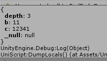
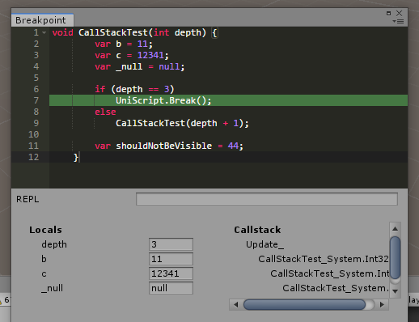

Script Debugging API
====

### UniScript.DumpLocals()

Prints all local variables in current scope.
```cs
UniScript.DumpLocals();
```




### UniScript.Break()

Shows debug window. Works only Editor environment.
```cs
UniScript.Break();
```


