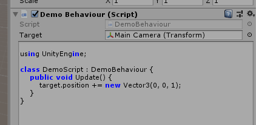

Working with Editor referencing
====

__Unity__ provides many useful editor features to make an linkage between C# and Editor objects.<br>
However, scripts cannot use these features because they are not a compiled assembly and cannot be reflected.<br>
<br>
In this section, introduces the simple way to solve these problems.

Public field
----
```cs
public class DemoBehaviour : UniScriptBehaviour
{
    public Transform target;

    void Awake()
    {
        Bind(@"
using UnityEngine;

class DemoScript : DemoBehaviour {
    public void Update() {
        target.position += new Vector3(0, 0, 1);
    }
}");
    }
}
```




UnityEvent
----

```cs
public void OnClickButton() {
  // Bypass the click invocation to script
  instance.Invoke(nameof(OnClickButton));
}
```


